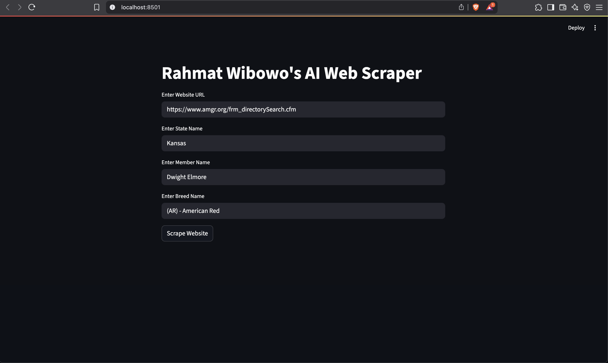
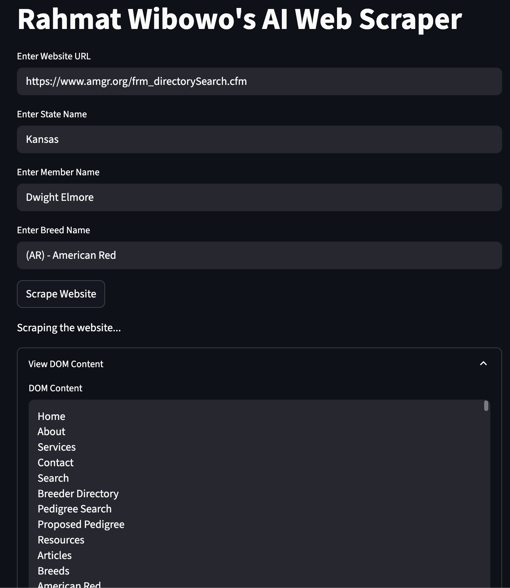
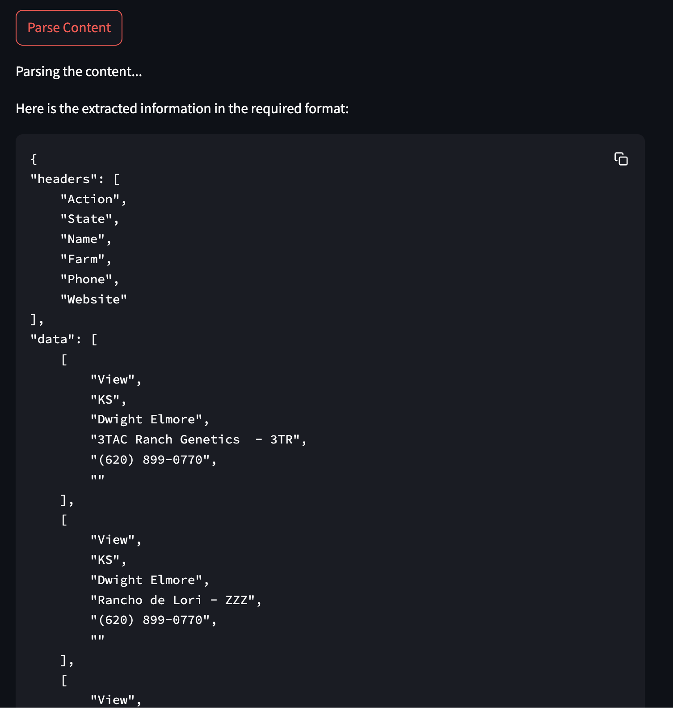
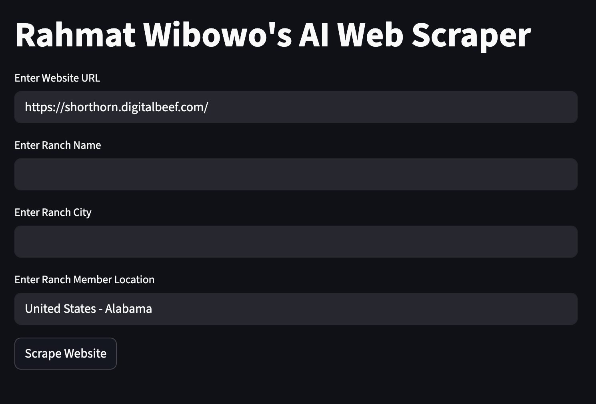
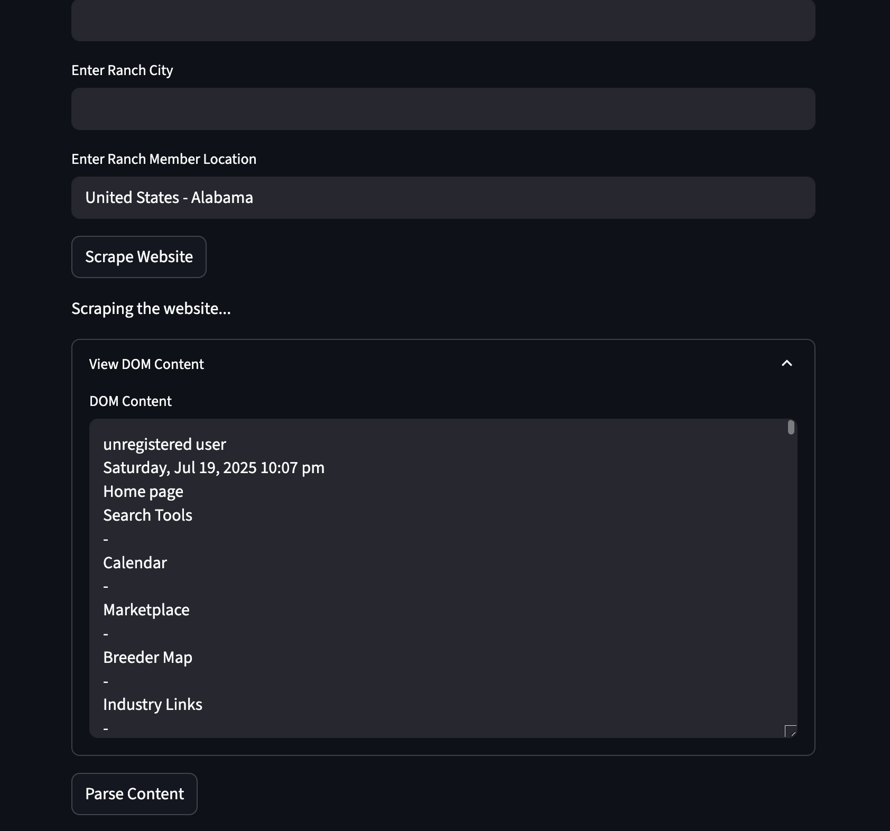
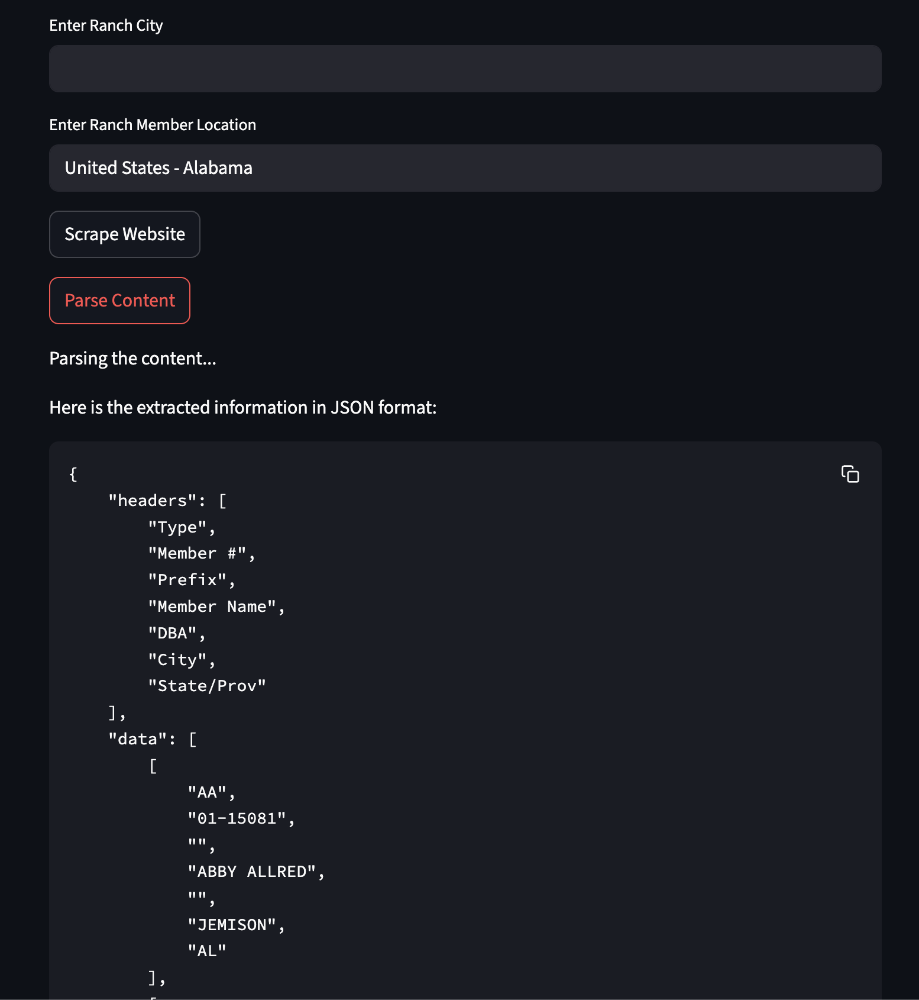

# AI-Web-Scraper

An AI-powered web scraper that combines Selenium for browser automation, BeautifulSoup for HTML parsing, and Ollama (via LangChain) for AI-driven content extraction. Built with Streamlit for an interactive UI.

---

## Table of Contents
1. [Project Overview](#project-overview)
2. [Why This Approach?](#why-this-approach)
3. [Setup Instructions](#setup-instructions)
4. [Usage Guide](#usage-guide)
5. [How It Works (Manual)](#how-it-works-manual)
6. [Troubleshooting](#troubleshooting)
7. [Credits](#credits)

---

## Project Overview

This tool allows you to:
- Scrape dynamic web pages using Selenium (with ChromeDriver)
- Extract and clean relevant HTML content
- Use AI (Ollama + LangChain) to parse and structure the scraped data
- Interact with the process via a Streamlit web interface

---

## Why This Approach?

- **Selenium**: Handles dynamic, JavaScript-heavy websites that static HTTP requests can't process. It simulates real user interactions (form filling, button clicks).
- **BeautifulSoup**: Efficiently parses and cleans HTML content for further processing.
- **Ollama + LangChain**: Leverages local LLMs (like `llama3`) for flexible, robust data extraction and structuring, even from messy or semi-structured web content.
- **Streamlit**: Provides a simple, interactive UI for non-technical users to run scrapes and view results.
- **.env Configuration**: Keeps sensitive or environment-specific settings out of the codebase.

This combination ensures maximum flexibility, reliability, and ease of use for scraping and parsing complex web pages.

---

## Setup Instructions

### 1. Prerequisites
- Python 3.8+
- [Chrome browser](https://www.google.com/chrome/)
- [ChromeDriver](https://chromedriver.chromium.org/downloads) (matching your Chrome version)
- [Ollama](https://ollama.com/) installed and running locally
- The `llama3` model pulled via Ollama:
  ```bash
  ollama pull llama3
  ```

### 2. Clone the Repository
```bash
git clone <repo-url>
cd AI-Web-Scraper
```

### 3. Install Python Dependencies
```bash
pip install -r requirements.txt
```

### 4. Environment Variables
Copy `sample.env` to `.env` and edit as needed (if required by your setup):
```bash
cp sample.env .env
```

### 5. ChromeDriver Setup
- Place the `chromedriver` binary in the project root (or update the path in `scrape.py` if needed).
- Ensure it is executable:
  ```bash
  chmod +x chromedriver
  ```

### 6. Start Ollama
Make sure Ollama is running:
```bash
ollama serve
```

---

## Usage Guide

1. **Start the Streamlit App:**
   ```bash
   streamlit run main.py
   ```
	 For Easy Question
	 ```bash
   streamlit run main2.py
   ```
	 For Hard Question
2. **In the Web UI:**
   - Enter the target website URL (default provided)
   - Optionally enter State, Member, and Breed (for the sample site)
   - Click "Scrape Website" to fetch and display the page content
   - Click "Parse Content" to extract structured data using the AI model
   - View the parsed results in the UI

---

## How It Works (Manual)

### Step 1: Scraping
- Selenium launches Chrome and navigates to the target URL.
- The script fills out form fields (State, Member, Breed) if provided.
- It clicks the submit button and waits for the page to load.
- The full HTML of the resulting page is captured.

### Step 2: Cleaning
- BeautifulSoup extracts the `<body>` content and removes scripts/styles.
- The cleaned text is split into manageable chunks for AI processing.

### Step 3: Parsing with AI
- Each chunk is sent to the local LLM (via LangChain and Ollama) with a prompt describing the desired data structure (e.g., JSON with headers and data rows).
- The model returns only the requested data, which is aggregated and displayed.

### Step 4: User Interaction
- All steps are managed via a Streamlit UI, making the process accessible and repeatable.

---

## Troubleshooting

- **ModuleNotFoundError: No module named 'selenium'**
  - Run `pip install -r requirements.txt` to install all dependencies.
- **TypeError: WebDriver.__init__() got multiple values for argument 'options'**
  - Ensure you are using the correct Chrome initialization as in `scrape.py` (with `service=Service(...)`).
- **ollama._types.ResponseError: model 'llama3' not found (status code: 404)**
  - Run `ollama pull llama3` to download the model.
- **ChromeDriver errors**
  - Make sure the `chromedriver` binary matches your Chrome version and is executable.
- **Ollama not running**
  - Start it with `ollama serve` before running the app.

---
Test Case was generated by AI

## Easy Question


*Figure: The user enters the required fields .*

*Figure: The user receives the DOM from the scrapper.*

*Figure: The Streamlit UI displaying the result for an easy question.*
### Answer

```
{
"headers": [
    "Action",
    "State",
    "Name",
    "Farm",
    "Phone",
    "Website"
],
"data": [
    [
        "View",
        "KS",
        "Dwight Elmore",
        "3TAC Ranch Genetics  - 3TR",
        "(620) 899-0770",
        ""
    ],
    [
        "View",
        "KS",
        "Dwight Elmore",
        "Rancho de Lori - ZZZ",
        "(620) 899-0770",
        ""
    ],
    [
        "View",
        "Joy Hurlburt",
        "Range Ready Savanna - Hulburt Ranch ltd - RRS",
        "(403) 330-5399",
        ""
    ]
]
}
```

## Hard Question


*Figure: The user enters the required fields .*

*Figure: The user receives the DOM from the scrapper.*

*Figure: The Streamlit UI displaying the result for an easy question.*
### Answer

```
{
  "headers": [
    "Type",
    "Member #",
    "Prefix",
    "Member Name",
    "DBA",
    "City",
    "State/Prov"
  ],
  "data": [
    [
      "Bulls",
      "01-15081",
      "ABBY",
      "ABBY ALLRED",
      "",
      "JEMISON",
      "AL"
    ],
    [
      "Females",
      "01-28358",
      "AUTUMN",
      "AUTUMN BOEHMER",
      "",
      "FLORENCE",
      "AL"
    ],
    [
      "Both",
      "10-22871",
      "BLUETICK",
      "BLUETICK CATTLE COMPANY",
      "",
      "CADEN MERRILL",
      "DADEVILLE"
    ],
    [...]
  ]
}
```
## Credits
- Developed by Rahmat Wibowo for the AI Test Submission
- Uses open-source libraries: Selenium, BeautifulSoup, LangChain, Ollama, Streamlit

